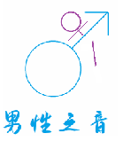

相关链接：[天生爱人的能力](https://baxi-beef.github.io/link1.html)  [男性游戏收录](https://poet000.github.io/yx/index.html)  [男性之光](https://baxi-beef.github.io/link2.html)  [网络生物观测站](https://baxi-beef.github.io/link2.html) [提交你的见解](https://github.com/baxi-beef/baxi-beef.github.io/issues)

> **Warnning**：
> 本网站还没有构建完全，很多页面是404的状态，请等待完善

 

# 男性之音网

```C++
#include <stdio.h>
/*你可能会问？这个网站是否厌女。
我给你的回答，不仅厌女，而且十分厌女。
为什么？
请阅读本段代码下面的引用
*/
int main(){
    printf("%s\n","欢迎来到一个属于男人的世界");
    printf("%s\n","来评论区交流你的看法");
    return 0;
}
```

> 厌男有理，厌女无罪！  
> 亲爱的男士，你并不需要害怕被她们指责“厌女”，请坚持你的想法，因为她们厌男没有人指责。

> 男性的崛起，并不意味着女性的跌倒
除非，她原本是站在男性的脊梁上。

