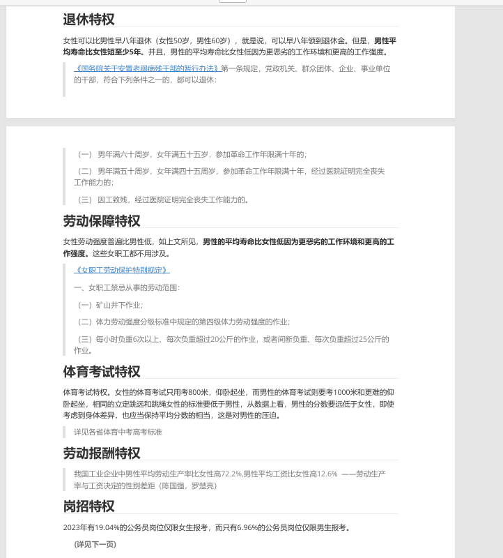

# 杜绝来自女性的赎罪券！好好爱自己，你便无罪

[TOC]

> 古代男性没有性别特权，古代男性和现代男性都是供养者，只不过古代男性作为承担供养责任的对价拥有决策权，而现代男性只能当供养工具人。真正享有特权的只有现代女性，真正受到压迫的只有现代男性。

## 什么是赎罪券？

## 女权向男性发售的赎罪券

## 古代女性受压迫？但是要求现代男性偿还？

请问现代男性有在压迫女性吗？**我怎么感觉好像是反过来呢？**

她们也许会跟你说，父系社会压迫了她们五千年。（但这是真的吗？答案是只有一半是真的。）

> 那咋了，以前压迫的现在总要还的？

> 那么请问，三万五千年母系社会，以女性为领导者，结果男人非但没什么地位，还要冒着生命危险出去打猎 。请问这个债你们要还吗？父权社会才5000年啊！还剩三万年！你却不想还债了？

> 从古至今都不是男性对女性的压迫，古代男性也收到压迫，战乱最容易被杀的也是男性，入宫还要被阉割的也是男性。都是阶级压迫。

但是她们不可能跟你说，母系社会压迫了你三万五千年。（那时候男性既要出去干活，有没有什么权利）

按照她们的逻辑，需要还债的是她们！有原罪的也应该是她们。

##　整天“生孩子警告”的人，请问她们是退化成单细胞生物了吗？

请问人类何时做到了单性生殖？那不还是需要男性配合？

## 韩国Deepfake事件中的赎罪券

[什么是Deepfake？](https://baike.baidu.com/item/%E6%B7%B1%E5%BA%A6%E4%BC%AA%E9%80%A0/56522542)

某些女拳拿一个还没有发生的事情，强行按在CN男性头上（我至今想不明白，CN男和KR男有何关系？她们口中喊着：“女性无国界”，可是也没见她们支援巴勒斯坦受难妇女儿童。如果她们真觉得女性无国界，那么她们早就把[这里面](https://baxi-beef.github.io/link3.html)的特权抛弃掉了。毕竟这里面大多数内容是CN特供。或者说，她们该不会和以色列是……），所以，现在CN男应该先给予补偿。

换句话讲，虽然你现在没有犯罪，但是呢为了防止你以后犯罪，你先把罚金给交了。至于你交了罚金以后，现在是不是可以肆无忌惮的犯罪了呢？不好意思还是不可以。到时候你真的犯罪了，该罚多少钱还是要罚多少钱。你如果没有犯罪，这笔钱可不可以退呢？不好意思，因为你还没有死，就还有犯罪的可能性。

说个暴论，但很现实：“十个女的九个喜欢玩这一套”。这就是女权常用的赎罪券原理，即以未发生的恶事为借口，要求男性给予补偿。这种逻辑类似于中世纪的赎罪券，强行将未来的罪过安在男性身上，要求其提前支付罚金。作者指出，女性常以安全感为由，要求男性给予物质补偿，即使目前并未做出任何不妥之事。

这包括但不限于某些女的口中的“安全感”之类的，先给你发上赎罪券，后面你“有罪”，再罚一遍。“无罪”，也退不了之前收的“罚金”。

##　结语

各位男士们，相信通过这个文章你们已经看到了她们是如何用赎罪券让你爆金币的。

既然看到了，那么我们即使不会反驳，也不要随她们意愿。随她们指责你吧，她们的指责只是一群狗的无能狂吠。